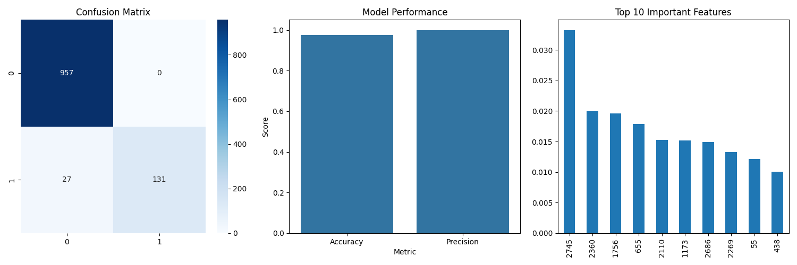

# Spam Detection System With Enhanced MBO 🦋

## Introduction

The Spam Detection System is a comprehensive tool designed to train and deploy models for classifying emails and SMS messages as spam or not spam. The system provides a user-friendly interface built with Tkinter for both training models and classifying messages. It supports multiple models, including a lite model, a legacy model, and an optimized model using the Monarch Butterfly Optimization algorithm 🦋.

## Project Structure

The project is organized as follows:

```
spam_detection/
├── app.py
├── train.py
├── training/
│   ├── train_model_lite.py
│   ├── train_model_legacy.py
│   └── train_model_mbo.py
├── data/
│   └── spam.csv
├── models/
│   ├── model.pkl
│   ├── vectorizer.pkl
│   ├── model_optimized.pkl
│   ├── vectorizer_optimized.pkl
│   └── metrics.txt
├── graphs/
│   ├── dataset_insights.png
│   ├── wordclouds.png
│   └── performance_metrics.png
└── README.md
```

- **`app.py`**: The main application script for the Spam Classifier UI.
- **`train.py`**: The main application script for the Model Trainer UI.
- **training/**: Directory containing scripts for training different models.
    - **`train_model_lite.py`**: Script for training the lite model.
    - **`train_model_legacy.py`**: Script for training the legacy model.
    - **`train_model_mbo.py`**: Script for training the model with the Monarch Butterfly Optimization algorithm 🦋.
- **data/**: Directory containing the dataset (`spam.csv`).
- **models/**: Directory where trained models and vectorizers are saved.
- **graphs/**: Directory where generated visualizations are saved.
- **README.md**: Project documentation.

## Getting Started

### Prerequisites

- **Python 3.6 or higher**
- **pip** package installer

### Required Python Packages

Install the required packages using the following command:

```bash
pip install -r requirements.txt
```

*Note: The requirements.txt file should contain all the necessary packages, including but not limited to:*

- tkinter
- nltk
- scikit-learn
- pandas
- numpy
- matplotlib
- seaborn
- wordcloud
- pillow (PIL)

### NLTK Data

The application uses the Natural Language Toolkit (NLTK) library, which requires certain datasets. These datasets are downloaded automatically when you run the scripts, but you can also download them manually:

```python
import nltk
nltk.download('punkt')
nltk.download('wordnet')
nltk.download('stopwords')
```

## Dataset

The dataset used for training is [`spam.csv`](data/spam.csv), which should be placed in the data directory. This dataset contains labeled messages indicating whether they are spam or ham (not spam).

## Application Overview

### Spam Classifier UI (app.py)

The `app.py` script launches a GUI application that allows users to input a message and classify it as spam or not spam using the selected model.

#### Features

- **Model Selection**: Users can choose between the optimized model or the legacy model.
- **Message Input**: Provides a text area for users to input the message to be classified.
- **Prediction**: Classifies the input message and displays whether it is spam or not spam.
- **Visual Feedback**: Displays the prediction result with color-coded text (red for spam, green for not spam).

#### How to Run

```bash
python app.py
```

#### Code Structure

- **SpamClassifierUI Class**: Contains the GUI setup and the logic for running the classification.
    - **__init__**: Initializes the GUI and loads the models.
    - **setup_ui**: Sets up the UI components.
    - **transform_text_legacy**: Preprocesses text for the legacy model (stemming).
    - **transform_text_optimized**: Preprocesses text for the optimized model (lemmatization).
    - **predict**: Handles the prediction logic.

### Model Trainer UI (train.py)

The `train.py` script launches a GUI application that allows users to train models using different algorithms and visualize the training results.

#### Features

- **Model Selection**: Users can choose to train the lite model, the legacy model, or the Monarch Butterfly Optimization (MBO) model 🦋.
- **Training Controls**: Provides a button to start training the selected model.
- **Progress Indication**: Shows a progress bar during training.
- **Visualizations**: Displays dataset insights, word clouds, and performance metrics after training.
- **Logs**: Provides a log tab to display training logs and error messages.

#### How to Run

```bash
python train.py
```

#### Code Structure

- **SpamDetectionUI Class**: Contains the GUI setup and logic for training models.
    - **__init__**: Initializes the GUI and sets up tabs.
    - **setup_training_tab**: Sets up the training controls and model selection.
    - **setup_visualization_tab**: Sets up the visualizations display area.
    - **setup_log_tab**: Sets up the log display area.
    - **start_training**: Begins the training process in a separate thread.
    - **train_model**: Handles model training logic based on the selected model.
    - **update_displays**: Updates the GUI with new visualizations and metrics after training.
    - **display_image**: Helper function to display images in the GUI.
    - **update_log**: Updates the log text area with training logs.

## Training Scripts

### `train_model_lite.py`


The lite model training script focuses on a streamlined approach with optimized parameters and enhanced feature extraction.

#### Features

- **Text Preprocessing**: Uses lemmatization and removes stop words and punctuation.
- **Feature Extraction**: Adds additional features such as text length, word count, unique word count, uppercase count, and special character count.
- **Model Creation**: Builds an ensemble model using SVC, MultinomialNB, and ExtraTreesClassifier with predefined optimized hyperparameters.
- **Visualization**: Generates graphs for dataset insights, word clouds, and performance metrics.
- **Metrics Saving**: Saves accuracy, precision, and F1 score to a metrics file.

#### How to Run Individually

```bash
python training/train_model_lite.py
```

### `train_model_legacy.py`


The legacy model training script retains the original model logic without optimization but updates the structure and adds visualizations.

#### Features

- **Text Preprocessing**: Uses stemming and removes stop words and punctuation.
- **Model Creation**: Builds an ensemble model using SVC, MultinomialNB, and ExtraTreesClassifier with original parameters.
- **Visualization**: Generates graphs for dataset insights, word clouds, and performance metrics.
- **Metrics Saving**: Saves accuracy and precision to a metrics file.

#### How to Run Individually

```bash
python training/train_model_legacy.py
```

### `train_model_mbo.py`


This script trains a model using the Monarch Butterfly Optimization algorithm 🦋 to optimize hyperparameters.

#### Features

- **Monarch Butterfly Optimization (MBO)**: Implements the MBO algorithm to find optimal hyperparameters for the model.
- **Parameter Optimization**: Optimizes parameters for SVC, MultinomialNB, and ExtraTreesClassifier as well as ensemble weights.
- **Model Creation**: Builds an ensemble model using the optimized parameters.
- **Visualization**: Generates graphs for dataset insights, word clouds, and performance metrics.
- **Metrics Saving**: Saves accuracy, precision, and F1 score to a metrics file.

#### How to Run Individually

```bash
python training/train_model_mbo.py
```

#### The Monarch Butterfly Optimization Algorithm

The MBO algorithm is a nature-inspired optimization technique that mimics the migration behavior of monarch butterflies 🦋. It is used in this project to find the optimal hyperparameters for the ensemble model.

**Key Components:**

- **Population Initialization**: Randomly initializes a population of possible solutions (butterflies).
- **Migration Operator**: Adjusts solutions based on the migration behavior, encouraging exploration and exploitation of the search space.
- **Fitness Function**: Evaluates solutions based on cross-validation scores.

## Dependencies and Libraries

- **tkinter**: For building the GUI applications.
- **nltk**: For natural language processing tasks.
- **scikit-learn**: For machine learning algorithms and tools.
- **pandas**: For data manipulation.
- **numpy**: For numerical computations.
- **matplotlib and seaborn**: For data visualization.
- **wordcloud**: For generating word cloud images.
- **Pillow (PIL)**: For image handling in the GUI.
- **pickle**: For saving and loading model objects.

## Visualizations

The system generates several visualizations to help understand the dataset and the model performance.

- **Dataset Insights** (`dataset_insights.png`): Histograms and box plots showing message length distribution, class distribution, and word count by class.


- **Word Clouds** (`wordclouds.png`): Visual representations of the most frequent words in spam and ham messages.


- **Performance Metrics** (`performance_metrics.png`): Confusion matrix, classification report, and top important features.



## Logs and Metrics

- **Logs**: The training scripts and applications output logs to help track the training process and any issues.
- **Metrics**: After training, key performance metrics are saved to metrics.txt in the models directory.
    
Example content of metrics.txt:
```
Accuracy: 0.9825
Precision: 0.9700
F1: 0.9750
```

## Error Handling

- The applications include error handling to manage exceptions such as missing models or datasets.
- Informative messages are displayed to the user via message boxes or log outputs.

## How to Train and Test Models

1. **Prepare the Dataset**: Ensure `spam.csv` is placed in the data directory.
2. **Run the Trainer GUI**: Execute `python train.py` to launch the training application.
3. **Select the Model**: Choose the model you wish to train (Lite, Legacy, MBO) from the GUI.
4. **Train the Model**: Click the "Train Model" button to start training. Progress and logs will be displayed.
5. **View Visualizations**: After training, navigate to the "Visualizations" tab to see the generated graphs.
6. **Check Metrics**: Metrics will be displayed in the "Model Metrics" section and saved to metrics.txt.
7. **Test the Classifier**: Run python app.py to launch the spam classifier application and test message classification.

## Additional Notes

- **Directory Creation**: The applications will create required directories such as models and graphs if they do not exist.
- **Model Artifacts**: Trained models and vectorizers are saved in the models directory for reuse.
- **Data Encodings**: The dataset is read with encoding='latin-1' due to special characters.
- **Stratification**: Data splitting uses stratification to maintain class distribution across training and test sets.

## Troubleshooting

- **Missing NLTK Data**: If you encounter errors related to NLTK data, ensure that the necessary data packages (`punkt`, `wordnet`, `stopwords`) are downloaded.
- **ModuleNotFoundError**: Ensure all required Python packages are installed.
- **GUI Not Displaying Correctly**: Check your Python version and ensure that tkinter is properly installed.

## Contact and Support

For questions or support, please contact the project maintainers.

---

This documentation provides a detailed overview of the Spam Detection System, including instructions on how to set up, train, and use the models. It covers the structure of the project, the functionalities of each component, and guidance on how to resolve common issues.
